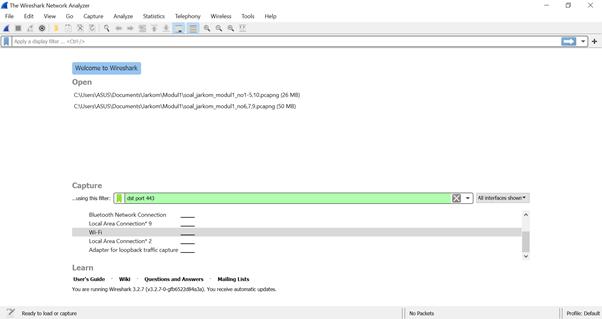

# Jarkom_Modul1_Praktikum_E8

### 1. Sebutkan webserver yang digunakan pada "testing.mekanis.me"!
Wireshark Filter Expression
``` http.host contains "testing.mekanis.me" ```
- Gunakan wireshark filter expression di atas
- 

- Follow -> HTTP Stream
- 


web server yang digunakan : nginx/1.14.0 (Ubuntu)

### 2. Simpan gambar "Tim_Kunjungan_Kerja_BAKN_DPR_RI_ke_Sukabumi141436.jpg"!
Wireshark Filter Expression
- File -> Export Objects -> HTTP
- 


- Cari gambar dengan mengetikkan "Tim_Kunjungan_Kerja_BAKN_DPR_RI_ke_Sukabumi141436.jpg"
- 


- Save gambar
- 


### 3. Cari username dan password ketika login di "ppid.dpr.go.id"!
Wireshark Filter Expression
``` http.request.method == POST ```
- Gunakan wireshark filter expression di atas
- 

- Follow -> HTTP Stream
- 
- 

Terlihat bahwa
Username = 10pemuda
Password = guncangdunia

### 4. Temukan paket dari web-web yang menggunakan basic authentication method!
Wireshark Filter Expression
``` http.authbasic ```
- Gunakan wireshark filter expression di atas
- Muncul paket-paket yang menggunakan basic authentication method
- 

### 5. Ikuti perintah di aku.pengen.pw! Username dan password bisa didapatkan dari file .pcapng!
Wireshark Filter Expression
``` http contains "aku.pengen.pw" ```
- Gunakan wireshark filter expression di atas
- 

- Follow -> TCP Stream
- 

- Cari Authorization
- 

- Decode

Mendapat
Username: kakakgamtenk
Password: hartatahtabermuda

- 
- 

### 6. Seseorang menyimpan file zip melalui FTP dengan nama "Answer.zip". Simpan dan Buka file "Open This.pdf" di Answer.zip. Untuk mendapatkan password zipnya, temukan dalam file zipkey.txt (passwordnya adalah isi dari file txt tersebut).
Wireshark Filter Expression
``` ftp-data ```
Download Answer.zip
- Gunakan wireshark filter expression di atas
- 

- Cari yang infonya STOR Answer.zip
- Follow -> TCP Stream
- 

- Simpan
- 

Cari Password
- 
- Gunakan wireshark filter expression di atas
- Cari yang infonya STOR zipkey.txt
- Follow -> TCP Stream
- 

- Mendapat password
- 
- 
- 

### 7. Ada 500 file zip yang disimpan ke FTP Server dengan nama 1.zip, 2.zip, ..., 500.zip. Salah satunya berisi pdf yang berisi puisi. Simpan dan Buka file pdf tersebut. Your Super Mega Ultra Rare Hint = nama pdf-nya "Yes.pdf"
Wireshark Filter Expression
``` frame contains “Yes.zip” ```
- Gunakan wireshark filter expression di atas
- 

- Follow -> TCP Stream
- 

- Download
- 

### 8. Cari objek apa saja yang didownload (RETR) dari koneksi FTP dengan Microsoft FTP Service!
Wireshark Filter Expression
``` ftp contains “Microsoft” ```
- Gunakan wireshark  filter expression di atas
- 

- Dapatkan IP
- Menggunakan IP yang telah ditemukan untuk mencari objek apa saja yang didownload dengan wireshark filter expression di bawah

Wireshark Filter Expression
``` ftp.request.command == RETR && ( ip.src == 198.246.117.106 || ip.dst == 198.246.117.106) ```
- 

### 9. Cari username dan password ketika login FTP pada localhost!
Wireshark Filter Expression
``` ftp.request.command == RETR ```
- Gunakan wireshark filter expression di atas
- 

- Follow -> TCP Stream
- 

Mendapat
username : dhana
password : dhana123
- 

### 10. Cari file .pdf di wireshark lalu download dan buka file tersebut! clue: "25 50 44 46"
Wireshark Filter Expression
- Search di display filter dengan tombol Ctrl + F
- Cari di hex value 25 50 44 46
- Follow -> TCP Stream
- Save

- 
- 
- 

### 11. Filter sehingga wireshark hanya mengambil paket yang mengandung port 21!
Wireshark Filter Expression
``` port 21 ```
- 

### 12. Filter sehingga wireshark hanya mengambil paket yang berasal dari port 80!
Wireshark Filter Expression
``` src port 80 ```
- 

### 13. Filter sehingga wireshark hanya menampilkan paket yang menuju port 443!
Wireshark Filter Expression
``` dst port 443 ```
- 
- 

### 14. Filter sehingga wireshark hanya mengambil paket yang berasal dari ip kalian!
Wireshark Filter Expression
``` src host 192.168.42.119 ```
- 
- 

### 15. Filter sehingga wireshark hanya mengambil paket yang tujuannya ke monta.if.its.ac.id!
Wireshark Filter Expression
``` dst host monta.if.its.ac.id ```
- 
